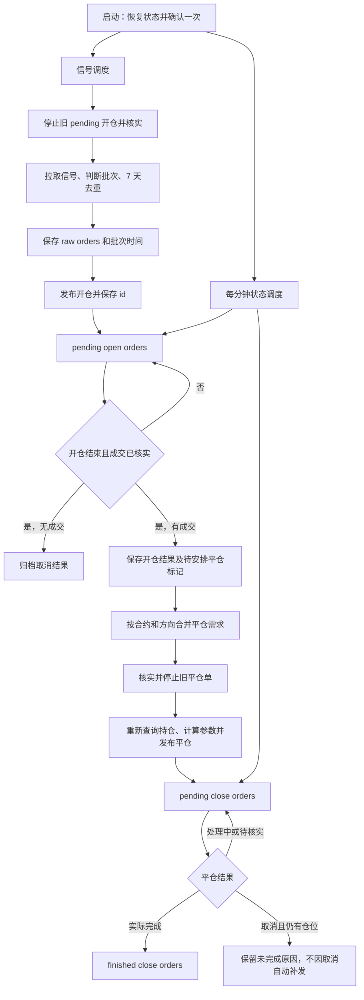

# 订单自动管理工作流

本文是后续实现的流程说明，不表示程序已经实现。以 [2.md](2.md) 的订单分组为基础，合并原文末尾的五条补充；平仓公式和撤换触发参考 [4.md](4.md)。随笔中的根目录 `4.md` 目前已位于 `docs/4.md`。

## 一、已确定的业务规则

| 项目 | 规则 |
| --- | --- |
| 信号调度 | 按配置运行：每分钟、每日指定时间或每周指定时间等 |
| 状态调度 | 开仓、平仓每分钟轮询，独立于信号调度；没有新信号也继续管理旧单 |
| 开仓去重 | 相同 `Contract + Side`，最近 7 天内成功完成开仓或部分成交后取消则跳过；从成交接口 `finish` 字段对应的实际开仓完成时间起算 |
| 部分成交 | 等开仓结束、剩余委托核实清楚后，再统一安排已成交部分的平仓 |
| 平仓策略 | 采用 `4.md` 的持仓价格公式、固定 `1%` 追踪回撤和同方向总持仓撤换策略 |
| 手动确认 | “一次即可”按每次启动自动交易时确认一次理解；运行中停止、开仓、平仓不再逐单要求输入 YES |
| 历史保留 | 发布平仓后仍保留开仓历史，供 7 天去重使用 |

7 天按连续 `7 × 24` 小时计算：`0 ≤ 当前时间 - 开仓完成时间 < 7 天` 时拦截，满 7 天后允许再次开仓。例如 BTC 开多完成后，第 6 天的 BTC 开多信号被跳过，BTC 开空独立判断。平仓是否完成不改变这次去重的起算点。

## 二、整体流程



两个调度器独立计时，但同一 `Contract + 仓位方向` 的停止、发布和转组必须串行执行，避免信号刷新和状态轮询重复创建订单。同一目标上一轮尚未完成时，不叠加下一轮操作。

启动恢复时，先核对已有订单 id、未完成的发布意图和结果不明的请求，再发布新单。本地状态和交易所操作无法组成一个原子事务，必须保留足够信息用于对账。

## 三、信号刷新：停止旧开仓 → 拉取 → 去重 → 保存

沿用 `2.md` 的明确顺序，先停止旧开仓，再拉取信号：

1. 遍历 `pending open orders`，对仍可停止的追踪单调用 `/futures/usdt/autoorder/v1/trail/stop`。
2. 检查停止响应的业务结果，再查询详情、子订单和成交记录。追踪停止不等于子订单已撤销，也不等于没有成交。
3. 已结束且无成交的开仓归档取消；有成交的进入统一平仓安排。停止失败或结果不明时保留旧记录，对应交易目标不得发布替代开仓。
4. 拉取 `https://raw.githubusercontent.com/huan00000/price/refs/heads/main/size.txt`，完整校验 `Orders Times` 和订单字段。下载或解析失败时不更新批次时间，不覆盖已有数据。
5. 比较源文件 `Orders Times` 与 `last timestamp`：相等为重复批次，小于为旧批次，均不再次导入；大于才处理新批次。
6. 对新批次逐条按 `Contract + Side` 检查最近 7 天成功完成或部分成交后取消的开仓记录，命中则跳过，未命中才进入 `raw orders`。
7. 将新批次、订单和 `last timestamp` 一并可靠保存；全部信号被去重时也记录该批次已处理。旧批次尚未提交的 raw 信号标记为已被替代，不继续发布；已提交但结果不明的请求仍须核实。
8. 发布符合条件的 raw 订单。若某个目标的旧单尚未核实完，新信号保持待处理；核实后重新做 7 天去重再决定是否发布。

**这一顺序的直接结果**：即使随后下载失败、收到重复或旧批次，前面的停止操作也已经发生。本文保留该规则；若希望“确认新批次后才停旧单”，需要修改此处的业务顺序。

信号刷新只停止旧开仓，现有平仓继续运行；旧平仓只由第六节的撤换流程处理。同批次重复或冲突目标须在校验阶段处理，不能造成重复开仓。

## 四、发布开仓与保存回执

1. 校验合约、方向、价格和合法张数。信号负 `Size` 表达空头方向，不能直接照搬为开空请求的 `amount`；参数按已验证的方向映射生成。
2. 发布前持久化本次发布意图，防止重启后把在途请求当成未提交信号。
3. 调用 `/futures/usdt/autoorder/v1/trail/create`。取得 `data.id` 后立即保存，再以该 id 查询 `/trail/detail`，不能使用样例里另一笔订单的 id。
4. 从 `raw orders` 转入 `pending open orders`，保留来源批次、原始信号、订单 id 和状态。源组删除与目标组新增必须一次保存。
5. 详情查询失败时仍保留创建成功的 id，后续继续查询，不重新创建。
6. 明确创建失败时保存原因；超时、响应丢失、创建后本地保存失败属于结果不明，先核实，不直接重发。

创建成功只表示追踪委托已经建立，不表示已经成交。

## 五、开仓轮询：结束后统一安排平仓

每分钟按 id 查询详情，读取 `data.order.original_status`，并结合子订单和成交记录确认结果。

| original_status | 处理 |
| --- | --- |
| 1：pending | 等待激活，继续查询 |
| 2：ongoing | 追踪中，继续查询 |
| 3：partial | 保存累计成交量，等待开仓结束，不立即为新增成交发布平仓 |
| 4：success | 核实实际成交量、子订单终态和开仓完成时间；确认后转入 `finished open orders`，标记待安排平仓 |
| 5：canceled | 核实子订单与成交；无成交则归档取消，有成交则保存“部分成交后结束”的结果并标记待安排平仓 |
| 未知或查询失败 | 保留记录继续核实，不判定完成或取消 |

“开仓结束”指追踪单结束，且相关子订单已完成或撤销、最终成交量明确。停止接口成功、`status="finished"` 或 `finished_at` 非零都不能单独证明成功开仓。

部分成交后取消必须与全部成功完成区分，已成交仓位仍进入平仓管理。成功完成开仓和部分成交后取消均启动 7 天去重；无成交取消不启动。去重起算时间取成交接口的 `finish` 字段，不使用单笔 `Orders Times` 或取消时间。

## 六、平仓安排：同合约同方向按当前总持仓撤换

### 6.1 覆盖范围与触发条件

采用 `4.md` 的整个方向持仓策略：一张平仓单可覆盖多笔开仓，也可能覆盖账户中同方向的其他持仓，不能为每个来源 id 各建一张全量平仓单。任务需保留覆盖的来源开仓 id，开仓历史本身不能删除。

触发条件是出现“开仓已结束、有成交、尚未安排平仓”的来源。仅价格或保证金变化，或仅发现平仓被取消，不触发自动撤换。

### 6.2 撤换顺序

1. 按 `Contract + 仓位方向` 合并本轮待处理来源，生成或恢复同一个平仓安排任务。
2. 检查来源是否已关联待处理或已完成任务，避免每轮重复安排。
3. 初步查询并校验对应持仓；无法匹配唯一、方向正确的持仓时先核实。
4. 停止该目标的旧 pending 平仓单，检查业务结果，并核实子订单及已平数量。旧单结果不明时不创建替代单。
5. 停止核实后重新查询当前持仓，按剩余的整个方向持仓计算价格和数量，不能沿用停止前的旧数量。
6. 保存发布意图并创建新平仓单。取得 id 后保存到 `pending close orders`，关联来源及旧任务，并将来源标记为已安排。
7. 旧单按实际结果归档为完成或已撤换；不能把取消记成成功完成。新单明确创建失败时保留待安排任务，下次重新查持仓并计算；结果不明时先核实，不直接重发。

若持仓已为零，应核对旧单成交及其他持仓变化，确认原因后结束安排，不发布零数量订单。

### 6.3 平仓参数

使用同一次持仓查询的 `E=entry_price`、`V=value`、`M=initial_margin`、`S=size`：

```text
V_adjusted = V                              当 S > 0
V_adjusted = -V                             当 S < 0
target_raw = E × (1 + 3.1 × M / V_adjusted)
target = target_raw × 1.01                  多仓
target = target_raw × 0.99                  空仓

activation_price = 按所有合并来源完成开仓 price 的最大小数位数，
                   使用 ROUND_HALF_UP 对 target 四舍五入
price_offset = "1%"
amount = -S
```

| 持仓 | 平仓 Side | amount | reduce_only | is_gte |
| --- | --- | --- | --- | --- |
| 多仓，S > 0 | Close Long | 负数 | true | true |
| 空仓，S < 0 | Close Short | 正数 | true | false |

其余参数沿用 `4.md`：`price_type=3`、`pos_margin_mode="cross"`、`position_mode="dual_plus"`。实际持仓模式必须匹配，不匹配时不能强行套用。

保留 `V` 原始符号，空仓使用 `-V`，不能改为 `-abs(V)`。数值须有限，`V` 非零、`M` 非负、方向一致，计算与取整后的价格均为正。固定回撤 `1%` 与公式中的 `1.01 / 0.99` 是独立设置，激活价不是保证成交价。

例如 `E=100、V=1000、M=10`，来源 price 为 `"100.00"` 时，平多激活价为 `"104.13"`，平空为 `"95.93"`。

`4.md` 正常流程的来源 price 取开仓 `trigger_price`，其小数位数不等于合约 tick size。应分别保留信号价和触发价；多来源合并时，采用各来源开仓 `trigger_price` 中最大小数位数。例如两位与四位小数合并时，按四位小数取整。与合约价格步长不兼容时如何调整仍需明确；明确前不擅自调整价格。参数不满足交易所约束时保留任务并报错，不擅自调整公式下单。

### 6.4 参考实现不能直接照搬的部分

`4.md` 旧实现会删除已安排平仓的来源开仓，只凭停止请求未抛异常继续创建，并可能删除部分成交或取消记录。本流程需要保留去重历史、核实停止结果、保存部分成交和不明请求。复用的是价格公式、总持仓范围及新来源触发撤换的策略。

## 七、平仓轮询与取消处理

| original_status | 处理 |
| --- | --- |
| 1 / 2 | 保留 pending，继续查询 |
| 3 | 保存实际已平数量和剩余数量，不记为全部完成 |
| 4 | 核实实际平仓成交；任务覆盖数量完成后转入 `finished close orders` |
| 5 | 核实已平数量、残余子订单和剩余持仓；归档取消结果，有剩余则保留未完成原因 |
| 未知或查询失败 | 保留记录继续核实，不重复发布 |

任务按自身覆盖的数量和方向核对。发布后若又新增仓位，不能仅因账户持仓未归零就断言旧任务未完成。

按 `4.md`，成功发布的平仓单后来取消，**不因取消本身自动补发**。应明确显示仍有未完成平仓需求，不能视作整个流程完成；以后新的开仓结束来源可重新触发总持仓平仓。若要“取消后有持仓就自动补发”，需另行增加业务规则。

这与撤换过程中“旧单已停、新单明确创建失败”不同：后者仍保留原待安排任务并重试；创建结果不明则先对账。

## 八、分组、时间与恢复依据

| 分组 | 职责 |
| --- | --- |
| raw orders | 已导入、尚未成功发布的信号；保存待提交、明确失败或提交结果待核实等本地状态 |
| pending open orders | 已发布、仍运行或尚需核实的开仓 |
| finished open orders | 已结束并核实的开仓结果；区分成功、部分成交后取消、无成交取消，成功完成和部分成交后取消的记录均用于 7 天去重，无成交取消不计入 |
| pending close orders | 已发布、仍运行或尚需核实的平仓 |
| finished close orders | 已确认成功完成的平仓；取消、撤换另存终态历史，不混入成功记录 |

五个分组之外的操作进度也要持久化，包括待安排平仓、提交结果不明、取消与撤换历史。不强制增加界面分组，但恢复时不能遗漏这些任务。

时间分开保存，统一使用 UTC 毫秒时间戳：

| 字段 | 含义 |
| --- | --- |
| last timestamp / 来源批次时间 | 源文件 `Orders Times`，用于批次判断 |
| 创建时间 | 详情 `created_at` 秒转毫秒；单笔 `Orders Times` 的取值仍待明确，但不用于 7 天去重 |
| 开仓完成时间 | 取成交接口 `finish` 字段，核实并统一转换为 UTC 毫秒后用于 7 天去重；成功完成和部分成交后取消均适用，不能用单笔 `Orders Times`、查询时间、创建时间或取消时间代替 |
| 结束时间 | 追踪单成功或取消的终态时间，与实际成交完成时间分开 |
| 平仓完成时间 | 核实后的实际平仓完成时间 |

时间缺失或异常时保留待核实，不用猜测时间放行去重。`*_precise` 样例看似微秒，在确认定义前不依赖它转换；`activated_at_precise` 非空不能单独证明已激活。

每笔记录须能恢复来源批次、交易目标、id、状态、实际成交量、终态结果及来源/平仓关联。转组与关联更新一次提交。恢复时以本地订单 `order list` 为唯一恢复依据；数据库或其他文件如同时存在，仅作为可重建输出，不反向覆盖本地 `order list`。上述订单、历史和操作进度均须在本地 `order list` 中可靠保存，恢复后仍须与交易所核实在途请求和订单状态。

7 天到期仅代表去重失效，不代表可以删除仍被平仓任务引用的历史。

## 九、接口证据与剩余待明确事项

[test_response.md](test_response.md) 中，创建取 `data.id`，详情取 `data.order`，列表取 `data.orders`。列表可辅助恢复，管理对象仍须关联具体 id。`amount` 是委托数量，持仓 `size` 是当前总仓位，均不能单独证明某笔订单的实际成交量，实现还需对接子订单与成交查询。

原文引用的 README 方向表与 `4.md` 及平空样例不同。本文平仓参数统一采用第六节参考策略；正式实现仍须核对目标接口的请求语义，不能仅凭响应标签判定映射正确。

已明确的处理规则：

1. 部分成交后取消也启动 7 天去重，同合约同方向的新信号按拦住处理；已有成交始终进入平仓管理，无成交取消不计入去重。
2. 多来源合并时，采用各来源开仓 `trigger_price` 的最大小数位数，继续使用 `ROUND_HALF_UP` 四舍五入。
3. 用于 7 天限制的开仓完成时间取成交接口的 `finish` 字段，不使用单笔 `Orders Times`。
4. 恢复时以本地订单 `order list` 为唯一依据，其他存储作为可重建输出。

剩余需要明确的细节：

1. 按最大小数位数取整后，若价格仍不符合合约 tick size，采用什么调整规则？明确前保留任务并报错，不擅自调整下单。
2. 单笔 `Orders Times` 自身应记录哪个时间？该字段无论取什么值，都不参与 7 天去重。
3. 成交接口 `finish` 的具体接口路径、字段位置和时间单位是什么？若同一开仓对应多条成交记录，是否取最后一笔实际成交的 `finish`？部分成交后取消同样需要确定该取法。
4. 本地订单 `order list` 对应的具体文件或存储位置是什么？实现时需确定唯一读写位置。

## 十、验收场景

- BTC 开多完成后的第 6 天同方向信号被跳过；满 7 天后允许；BTC 开空独立判断。
- 部分成交后取消也拦截同合约同方向 7 天内的新信号；无成交取消不拦截。
- 7 天去重使用成交接口 `finish` 对应的开仓完成时间，修改单笔 `Orders Times` 不影响去重。
- 多来源价格分别为两位和四位小数时，合并平仓按四位小数取整；不符合 tick size 时保留任务并报错。
- 重启以本地订单 `order list` 恢复订单、历史和操作进度，其他存储不覆盖该依据。
- 平仓发布后开仓历史仍保留，重启不会丢失 7 天去重依据。
- 开仓部分成交时不发平仓；开仓结束且剩余委托核实后，已成交仓位统一进入平仓安排。
- 同方向多个来源只形成一个总持仓平仓安排；旧单未确认停止前不发替代单。
- 停止期间发生平仓成交时，新单使用重新查询后的剩余持仓。
- 创建超时、回执丢失或保存失败后先对账，重启和并发轮询不直接重复发布。
- 无新信号或下载失败时，已有开仓和平仓的状态轮询仍继续。
- 已发布平仓取消且仍有仓位时，显示未完成原因，不自动补发，不记为完成。
- 启动确认一次后，运行中不再逐单要求输入 YES。
